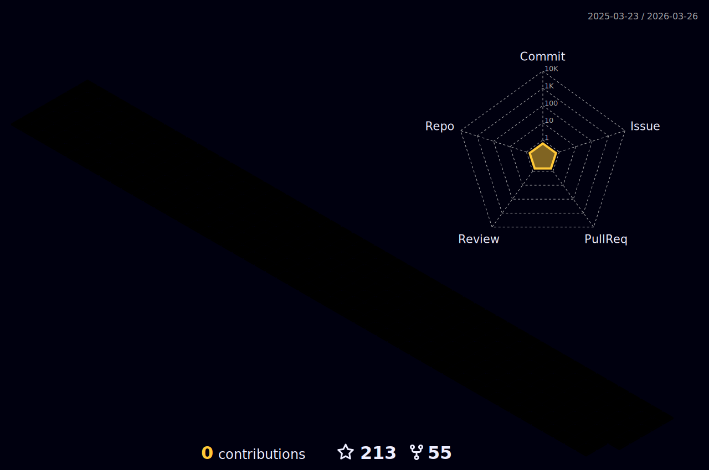

<!--  -->
 

 

<!-- <h2 align="center"> -->
<!-- </h2>  -->

<!-- Coder Uncle Pic

 -->

<!-- yorum satiri
<h2 dir="auto"><a id="user-content-necktie-about-me" class="anchor" aria-hidden="true" href="#necktie-about-me"><svg class="octicon octicon-link" viewBox="0 0 16 16" version="1.1" width="16" height="16" aria-hidden="true"><path fill-rule="evenodd" d="M7.775 3.275a.75.75 0 001.06 1.06l1.25-1.25a2 2 0 112.83 2.83l-2.5 2.5a2 2 0 01-2.83 0 .75.75 0 00-1.06 1.06 3.5 3.5 0 004.95 0l2.5-2.5a3.5 3.5 0 00-4.95-4.95l-1.25 1.25zm-4.69 9.64a2 2 0 010-2.83l2.5-2.5a2 2 0 012.83 0 .75.75 0 001.06-1.06 3.5 3.5 0 00-4.95 0l-2.5 2.5a3.5 3.5 0 004.95 4.95l1.25-1.25a.75.75 0 00-1.06-1.06l-1.25 1.25a2 2 0 01-2.83 0z">

### </path></svg></a> About Me ✅ </h2>
-->

<a href="https://discord.gg/hanzelkaraagac">
<strong> Click here to join our Discord server ⬅️ </a>

<!-- %7C -> alttaki yaziya | eklememize yariyor -->

<!--   
<h3 align="left">Skills: Java | Selenium | JUnit | TestNG | Cucumber | Git - GitHub | Html - Css | JIRA | PostgreSQL | LAMBDA | JDBC | API | </h3>
 -->
## <b> Languages and Tools:</b>
</a> 
 <a href="https://www.python.org/" target="_blank" rel="noreferrer">    <a href="https://www.w3.org/html/" target="_blank" rel="noreferrer">    <a href="https://www.mysql.com/" target="_blank" rel="noreferrer"><a href="https://www.selenium.dev/" target="_blank" rel="noreferrer">   
 </a>
 
 

 

 
 
  
  
  
  
  
  
  

 

<!-- 
name: GitHub-Profile-3D-Contrib

on:
  schedule: # 03:00 JST == 18:00 UTC
    - cron: "0 18 * * *"
  workflow_dispatch:

jobs:
  build:
    runs-on: ubuntu-latest
    name: generate-github-profile-3d-contrib
    steps:
      - uses: actions/checkout@v3
      - uses: yoshi389111/github-profile-3d-contrib@0.7.1
        env:
          GITHUB_TOKEN: ${{ secrets.GITHUB_TOKEN }}
          USERNAME: ${{ github.repository_owner }}
      - name: Commit & Push
        run: |
          git config user.name github-actions
          git config user.email github-actions@github.com
          git add -A .
          git commit -m "generated"
          git push
-->

 
 
##  <b>My Stats</b>

  
  
  

<!--  -->

