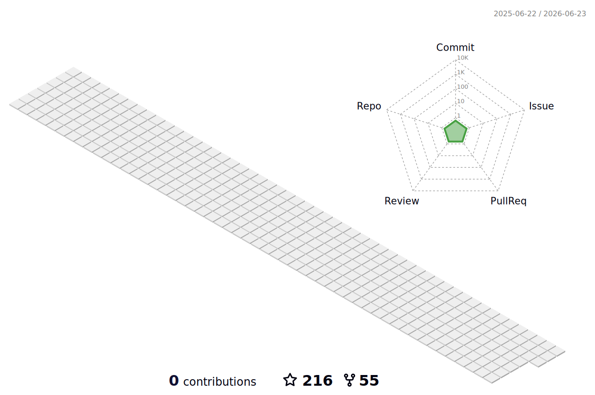

## Hanzel Karaagac
#### I am Hanzel from Turkey, I do content on QA Engineer.I really enjoy learning Java

  
## Skills: Java | Selenium | Cucumber | JIRA | SQL | JDBC | LAMBDA

<h3 align="left">Languages and Tools:</h3>
</a> 
 <a href="https://www.python.org/" target="_blank" rel="noreferrer">    <a href="https://www.w3.org/html/" target="_blank" rel="noreferrer">    <a href="https://www.mysql.com/" target="_blank" rel="noreferrer"> 

 
   

  

